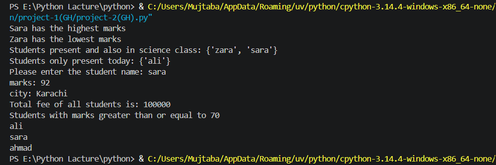
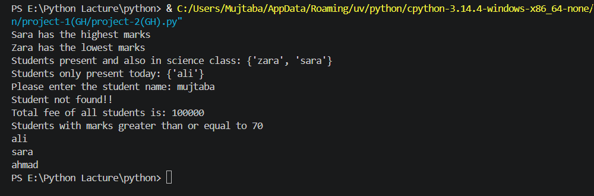

#  Student Management System

> A Python-based student data management system using dictionaries and sets.

---

# About the Project

This project simulates a basic **student management system** that stores and processes student data including marks, city, and fee. Built using Python data structures to perform real-world operations like searching, filtering, and calculating totals.

---

# Features

| Feature | Description |
|---------|-------------|
| Highest Marks | Finds the student with the highest marks |
| Lowest Marks | Finds the student with the lowest marks |
| Science Class Filter | Shows students present in both attendance and science class |
|  Student Search | Search any student by name to get their info |
| Total Fee | Calculates total fee of all students |
| Pass List | Shows students with marks ≥ 70 |

---

## 🖥️ Sample Output

**Output 1** — Student "Sara" searched successfully, highest/lowest marks displayed, science class filter applied, total fee calculated, and pass list shown.

**Output 2** — Student "Mujtaba" searched but not found in the system, demonstrating the error handling feature.

---

## 🚀 How to Run

1. Make sure Python is installed on your system
2. Clone this repository:
   `git clone https://github.com/ahmad-mujtaba648/student-management-system.git`
3. Run the file:
   `python project-2.py`

---

# Concepts Practiced

- Nested Dictionaries
- Sets and Set Operations (intersection, difference)
- `max()` and `min()` with manual value extraction
- `sum()` for total calculation
- Conditional statements
- User input and search logic (`name in dict`)

---

# Challenges Faced & Lessons Learned

| Challenge | What I Learned |
|-----------|----------------|
| `name in dict` searches keys, not values | Always clarify what you're searching — keys or values |
| `max()` / `min()` on nested dictionary | Extract values manually before applying functions |
| `union` and `intersection` confused initially | `a & b` = common, `a - b` = difference |
| `{}` creates a dict, not a set | Always use `set()` for an empty set |
| Hardcoding values instead of using dictionary | Access data directly from the source |

---

## 💻 Tech Stack

---

## 👨‍💻 Author

**Ahmad Mujtaba**
CS Student @ UET Lahore | Aspiring Cybersecurity & AI Engineer

